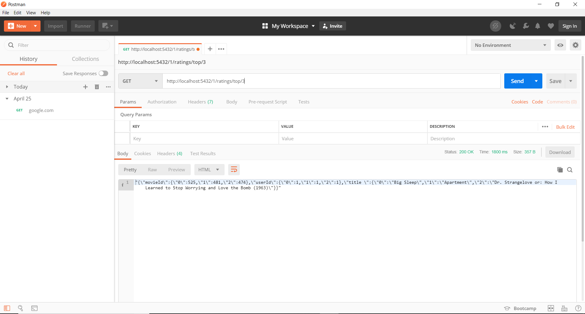
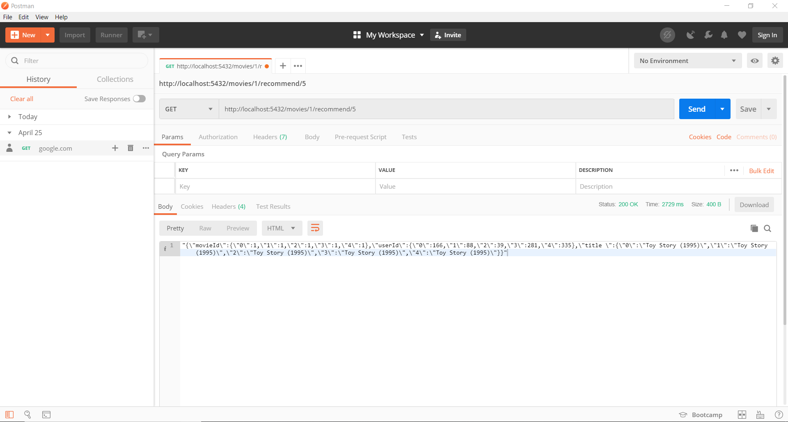

 # RECOMMENDATION ENGINE WITH FLASK

Struktur sistem terdiri dari 3 bagian :

1. Server.py
2. app.py
3. engine.py

Cara mengaktifkan nya adalah dengan menjalankan server.py dengan perintah " python server.py" dan tunggu hingga muncul tulisan "Engine Ready"

URL yang dapat diakses :

1. http://<Server_IP>:5432/<user_id>/ratings/top/

untuk menampilkan sejumlah rekomendasi film ke user

2. http://<Server_IP>:5432/movies/<movie_id>/recommend/

untuk menampilkan film terbaik ke sejumlah user

